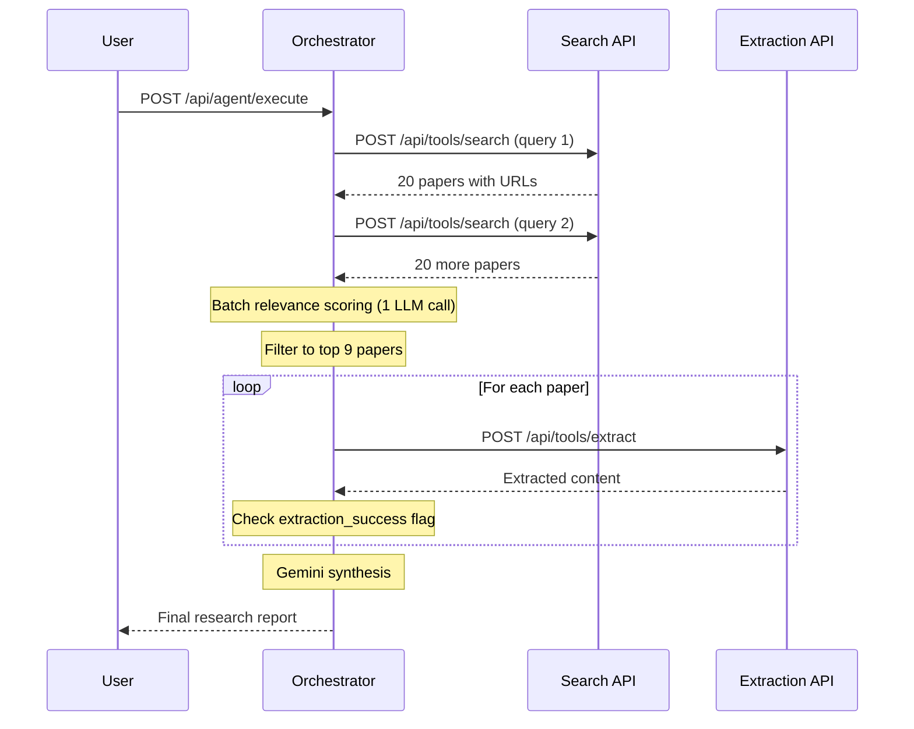

# Backend API Specification for Agentic Workflow Integration

**Version:** 1.0  
**Date:** November 8, 2025  
**Status:** Ready for Implementation

---

## 🎯 Integration Architecture

```
Agentic Server (Orchestrator)
    ↓
Search Service API (port 5000) → Returns real paper URLs
    ↓
Extraction Service API (port 5000) → Extracts content from URLs
    ↓
Gemini Synthesis → Final research report
```

**Important:** These API specs are based on the ACTUAL implementation in the agentic server. Field names, data types, and structures match exactly what the orchestrator expects.

---

## 📡 API 0: Agentic Server (Main Entry Point)

### Endpoint
```
POST http://localhost:8000/api/agent/execute
```

### Purpose
Main endpoint to initiate autonomous research workflow. This is what external users/frontend will call.

### Request Headers
```
Content-Type: application/json
```

### Request Payload
```json
{
  "research_goal": "What are recent advances in transformer architectures?",
  "scope_parameters": {
    "temporal_boundary": {
      "publication_window_years": 2
    },
    "quality_threshold": {
      "impact_level": "high_impact"
    },
    "discovery_depth": "comprehensive",
    "source_diversity_requirement": true
  }
}
```

#### Field Specifications
| Field | Type | Required | Description | Validation |
|-------|------|----------|-------------|------------|
| `research_goal` | string | **YES** | Research question/goal | 10-500 chars |
| `scope_parameters` | object | No | Optional refinement params | All fields optional |
| `scope_parameters.temporal_boundary.publication_window_years` | number | No | Years of papers to search | 1-10, default: 3 |
| `scope_parameters.quality_threshold.impact_level` | string | No | Quality filter | "cutting_edge", "high_impact", "established", "baseline" |
| `scope_parameters.discovery_depth` | string | No | Search comprehensiveness | "rapid" (10 sources), "focused" (15), "comprehensive" (30), "exhaustive" (50) |
| `scope_parameters.source_diversity_requirement` | boolean | No | Enforce diverse sources | default: true |

---

### Response Payload (IMMEDIATE - Job Started)
```json
{
  "job_id": "c7095ab4-2ff5-4502-82e4-9c272e65c1ea",
  "status": "INITIALIZED",
  "autonomous_analysis": {
    "goal_decomposition": {
      "primary_objectives": ["Find recent papers", "Analyze trends"],
      "sub_goals": ["Search academic databases", "Extract findings"]
    },
    "execution_strategy": {
      "search_approach": "Multi-query semantic search",
      "validation_rules": ["Year filter: 2023-2024", "Min citations: 10"]
    },
    "governance_applied": {
      "policies_checked": ["SourceQualityPolicy", "TemporalBoundaryPolicy"]
    }
  },
  "execution_plan": {
    "phases": [
      {
        "phase": "Autonomous Exploration",
        "description": "Execute 5 search queries to discover relevant sources"
      },
      {
        "phase": "Intelligent Validation",
        "description": "Apply governance rules to filter and validate sources"
      },
      {
        "phase": "Deep Extraction",
        "description": "Extract structured data from top 30 sources"
      },
      {
        "phase": "Meta-Analysis & Synthesis",
        "description": "Generate comprehensive research synthesis"
      }
    ],
    "estimated_sources": 30,
    "estimated_duration_minutes": 2
  }
}
```

**Note:** This returns immediately (~1 second). The agent continues working asynchronously.

---

### Monitoring Progress

#### Get Status
```
GET http://localhost:8000/api/agent/status/{job_id}
```

**Response:**
```json
{
  "job_id": "c7095ab4-2ff5-4502-82e4-9c272e65c1ea",
  "status": "EXTRACTING",
  "current_phase": {
    "phase_name": "EXTRACTING",
    "phase_description": "Extracting data from sources",
    "progress_percentage": 65,
    "intelligent_actions_taken": [
      "Discovered 15 sources",
      "Validated 12 sources",
      "Extracted 8 sources"
    ]
  },
  "autonomous_decisions": [
    {
      "timestamp": "2025-11-08T19:30:15Z",
      "decision_type": "ADAPTIVE_REFINEMENT",
      "reasoning": "Insufficient sources found",
      "action_taken": "Generated 2 refined search queries"
    }
  ],
  "quality_metrics": {
    "sources_discovered": 15,
    "sources_validated": 12,
    "sources_accepted": 12,
    "sources_rejected": 3,
    "average_quality_score": 0.85
  }
}
```

---

### Get Final Results

#### Get Results
```
GET http://localhost:8000/api/agent/results/{job_id}
```

**Response:**
```json
{
  "job_id": "c7095ab4-2ff5-4502-82e4-9c272e65c1ea",
  "status": "COMPLETED",
  "synthesis": {
    "research_goal": "What are recent advances in transformer architectures?",
    "executive_summary": "## Meta-Analysis: Transformer Architecture Advances\n\nRecent research shows significant improvements in efficiency and scale...",
    "synthesis_text": "Based on analysis of 9 research papers from 2023-2024...",
    "primary_themes": [
      "Sparse attention mechanisms",
      "Mixture of Experts architectures",
      "Efficient training methods"
    ],
    "gaps_identified": [
      "Limited work on mobile deployment",
      "Interpretability still unclear"
    ],
    "sources_analyzed": 9,
    "methodologies_found": 5
  },
  "execution_summary": {
    "total_sources_discovered": 15,
    "sources_validated": 12,
    "extractions_successful": 9
  },
  "audit_trail_summary": {
    "total_decisions_logged": 23,
    "full_audit_log_available": true
  }
}
```

---

### Example Integration Flow

```bash
# 1. Start research job
RESPONSE=$(curl -X POST "http://localhost:8000/api/agent/execute" \
  -H "Content-Type: application/json" \
  -d '{
    "research_goal": "What are recent advances in transformer architectures?",
    "scope_parameters": {
      "discovery_depth": "comprehensive"
    }
  }')

JOB_ID=$(echo $RESPONSE | jq -r '.job_id')
echo "Job started: $JOB_ID"

# 2. Poll for status (optional)
while true; do
  STATUS=$(curl -s "http://localhost:8000/api/agent/status/$JOB_ID" | jq -r '.status')
  echo "Status: $STATUS"
  
  if [ "$STATUS" = "COMPLETED" ]; then
    break
  fi
  
  sleep 10
done

# 3. Get final results
curl -s "http://localhost:8000/api/agent/results/$JOB_ID" | jq '.'
```

---

## 📡 API 1: Search Service

### Endpoint
```
POST http://search_service:5000/api/tools/search
```

### Purpose
Find relevant academic papers/sources based on search query and filters.

### Request Headers
```
Content-Type: application/json
```

### Request Payload
```json
{
  "query": "artificial intelligence trends",
  "filters": {
    "year_range": {
      "start": 2022,
      "end": 2024
    },
    "source_types": ["academic", "technical"],
    "min_quality_score": 0.7
  },
  "max_results": 20
}
```

#### Field Specifications
| Field | Type | Required | Description | Validation |
|-------|------|----------|-------------|------------|
| `query` | string | Yes | Search query text | 1-500 chars |
| `filters` | object | No | Search filters | Optional |
| `filters.year_range.start` | number | No | Start year | 1900-2025 |
| `filters.year_range.end` | number | No | End year | 1900-2025 |
| `filters.source_types` | string[] | No | Source types | ["academic", "technical", "news"] |
| `filters.min_quality_score` | number | No | Quality threshold | 0.0-1.0 |
| `max_results` | number | No | Max results to return | 1-100, default: 20 |

---

### Response Payload (SUCCESS)
```json
{
  "results": [
    {
      "url": "https://arxiv.org/abs/2401.12345",
      "title": "Transformer Architecture Evolution in Large Language Models",
      "snippet": "We propose a novel approach to transformer architectures...",
      "relevance_score": 0.92,
      "year": 2024,
      "citations": 150,
      "authors": ["Smith, J.", "Johnson, A.", "Chen, L."],
      "venue": "NeurIPS 2024",
      "doi": "10.48550/arXiv.2401.12345"
    }
  ],
  "total_found": 45,
  "search_metrics": {
    "query_time_ms": 234,
    "sources_searched": 3
  }
}
```

#### Response Field Specifications

**`results[]` Array of Objects:**
| Field | Type | Required | Description | Notes |
|-------|------|----------|-------------|-------|
| `url` | string | **YES** | Full URL to paper | Must be fetchable (arXiv, DOI resolver, etc.) |
| `title` | string | **YES** | Paper title | Used for relevance scoring |
| `snippet` | string | **YES** | Abstract/summary excerpt | 100-500 chars |
| `relevance_score` | number | **YES** | Relevance to query | 0.0-1.0, used for filtering |
| `year` | number | **YES** | Publication year | Integer (e.g., 2024) |
| `citations` | number | No | Citation count | Integer, used for quality assessment |
| `authors` | string[] | No | Author names | Format: "LastName, F." |
| `venue` | string | No | Publication venue | Conference/Journal name |
| `doi` | string | No | DOI identifier | Format: "10.xxxx/xxxxx" |

**Top-level fields:**
| Field | Type | Required | Description |
|-------|------|----------|-------------|
| `total_found` | number | Yes | Total matches found | Integer |
| `search_metrics.query_time_ms` | number | No | Query execution time | Milliseconds |
| `search_metrics.sources_searched` | number | No | Number of sources queried | Integer |

---

### Error Responses

#### No Results Found
```json
{
  "results": [],
  "total_found": 0,
  "search_metrics": {
    "query_time_ms": 150,
    "sources_searched": 3
  }
}
```
**Status Code:** 200 OK (not an error, just empty results)

#### Rate Limit Exceeded
```json
{
  "error": "Rate limit exceeded",
  "retry_after": 60
}
```
**Status Code:** 429 Too Many Requests

#### Server Error
```json
{
  "error": "Search service unavailable",
  "message": "Connection to arXiv failed"
}
```
**Status Code:** 500 Internal Server Error

---

### Integration Notes for Search API

1. **URL Requirements:**
   - URLs MUST be publicly accessible
   - Prefer: arXiv, DOI resolvers, direct PDF links
   - Avoid: Paywalled content, broken links

2. **Relevance Score Usage:**
   - Orchestrator uses this for filtering (threshold: 0.6)
   - Higher scores = higher priority for extraction
   - Algorithm: Your choice (TF-IDF, embedding similarity, etc.)

3. **Performance Expectations:**
   - Target response time: < 5 seconds
   - The orchestrator makes 3-5 sequential search calls per research goal
   - Rate limiting: Handle gracefully with 429 status

4. **Data Sources Recommendations:**
   - arXiv API (free, no rate limits with proper headers)
   - Semantic Scholar API (free tier: 100 req/5min)
   - CrossRef API (for DOI resolution)
   - Google Scholar (unofficial APIs available)

---

## 📡 API 2: Extraction Service

### Endpoint
```
POST http://extraction_service:5000/api/tools/extract
```

### Purpose
Extract structured content from academic papers/sources.

### Request Headers
```
Content-Type: application/json
```

### Request Payload
```json
{
  "source_url": "https://arxiv.org/abs/2401.12345",
  "extraction_parameters": {
    "focus_areas": ["methodology", "results"],
    "required_elements": [
      "key_findings",
      "methodology",
      "conclusions",
      "citations"
    ],
    "max_length": 5000
  }
}
```

#### Field Specifications
| Field | Type | Required | Description |
|-------|------|----------|-------------|
| `source_url` | string | **YES** | URL from search results | Must match URL provided by search API |
| `extraction_parameters` | object | No | Extraction configuration | Optional, use defaults if not provided |
| `extraction_parameters.focus_areas` | string[] | No | Areas to emphasize | E.g., ["methodology", "results"] |
| `extraction_parameters.required_elements` | string[] | No | Elements to extract | Default: all available |
| `extraction_parameters.max_length` | number | No | Max content length | Characters, default: 5000 |

---

### Response Payload (SUCCESS)

```json
{
  "extracted_content": {
    "title": "Transformer Architecture Evolution in Large Language Models",
    "abstract": "We propose a novel approach to transformer architectures that reduces computational complexity by 40% while maintaining accuracy. Our method introduces sparse attention mechanisms...",
    "key_findings": [
      "Proposed sparse attention mechanism reduces training time by 40%",
      "Model achieves 95.2% accuracy on GLUE benchmark",
      "Architecture scales efficiently to 175B parameters",
      "Inference latency reduced by 35% compared to baseline"
    ],
    "methodology": "We experimented with various sparse attention patterns on the GPT-3 architecture. Training was conducted on 300B tokens using 1024 A100 GPUs over 2 weeks. Evaluation followed standard benchmarks including GLUE, SuperGLUE, and domain-specific tasks.",
    "citations": [
      "Vaswani et al., 2017. Attention is All You Need. NeurIPS.",
      "Brown et al., 2020. Language Models are Few-Shot Learners. NeurIPS.",
      "Devlin et al., 2019. BERT: Pre-training of Deep Bidirectional Transformers. NAACL."
    ]
  },
  "metadata": {
    "extraction_success": true,
    "source_url": "https://arxiv.org/abs/2401.12345",
    "extraction_timestamp": "2025-11-08T19:30:00Z"
  },
  "extraction_metrics": {
    "processing_time_ms": 3450,
    "confidence_score": 0.89
  }
}
```

#### Response Field Specifications

**`extracted_content` Object:** (All fields optional but recommended)
| Field | Type | Required | Description | Format |
|-------|------|----------|-------------|--------|
| `title` | string | Recommended | Paper title | Plain text |
| `abstract` | string | Recommended | Paper abstract | 100-1000 chars |
| `key_findings` | string[] | **CRITICAL** | Main research findings | 3-7 bullet points, each 50-200 chars |
| `methodology` | string | **CRITICAL** | Research methodology | 200-1000 chars, describe approach |
| `citations` | string[] | Recommended | Referenced works | Format: "Author et al., Year. Title. Venue." |

**`metadata` Object:**
| Field | Type | Required | Description | Critical Notes |
|-------|------|----------|-------------|----------------|
| `extraction_success` | boolean | **MANDATORY** | Whether extraction succeeded | **Orchestrator checks this!** False = skips source |
| `source_url` | string | Yes | Original URL | Echo back from request |
| `extraction_timestamp` | string | Yes | When extraction occurred | ISO 8601 format |

**`extraction_metrics` Object:**
| Field | Type | Required | Description |
|-------|------|----------|-------------|
| `processing_time_ms` | number | No | Time taken to extract | Milliseconds |
| `confidence_score` | number | Recommended | Extraction quality confidence | 0.0-1.0 |

---

### Response Payload (FAILURE)

#### Extraction Failed
```json
{
  "extracted_content": {
    "title": "",
    "abstract": "",
    "key_findings": [],
    "methodology": "",
    "citations": []
  },
  "metadata": {
    "extraction_success": false,
    "source_url": "https://example.com/paper",
    "extraction_timestamp": "2025-11-08T19:30:00Z",
    "failure_reason": "PDF parsing failed - corrupted file"
  },
  "extraction_metrics": {
    "processing_time_ms": 1200,
    "confidence_score": 0.0
  }
}
```
**Status Code:** 200 OK (not HTTP error - use `extraction_success: false` flag)

#### Source Unavailable (404)
```json
{
  "error": "SOURCE_UNAVAILABLE",
  "message": "Failed to fetch content from URL"
}
```
**Status Code:** 404 Not Found

#### Timeout
```json
{
  "error": "EXTRACTION_TIMEOUT",
  "message": "Extraction exceeded 45 second limit"
}
```
**Status Code:** 504 Gateway Timeout

---

### Integration Notes for Extraction API

1. **Critical Success Flag:**
   ```python
   # Orchestrator checks this FIRST:
   if not response.get("metadata", {}).get("extraction_success", False):
       # Skip this source, don't use in synthesis
   ```
   **YOU MUST SET THIS CORRECTLY!**

2. **Content Quality Requirements:**
   - **Minimum:** `key_findings` with at least 2-3 findings
   - **Recommended:** Include `methodology` for research papers
   - **Optional:** `citations` adds credibility but not required

3. **Performance Expectations:**
   - Target response time: < 10 seconds per paper
   - Timeout: 45 seconds (orchestrator will abort)
   - The orchestrator calls this 9-30 times per research goal (sequentially)

4. **URL Handling:**
   - You'll receive URLs from the search API
   - Must handle: arXiv, DOI resolvers, direct PDFs
   - Recommend: Use PDF parsing libraries (PyPDF2, pdfplumber, GROBID)

5. **Extraction Strategies:**
   - **Best:** Full PDF parsing → section extraction
   - **Good:** Abstract + conclusion extraction
   - **Acceptable:** Title + abstract only (set `extraction_success: true` but lower confidence)
   - **Unacceptable:** Empty findings (set `extraction_success: false`)

6. **Error Handling Best Practices:**
   ```python
   # Return 200 OK with extraction_success: false for:
   - PDF parsing failures
   - Corrupted files
   - Insufficient content extracted
   
   # Return 404 for:
   - URL doesn't exist
   - Access denied (paywall)
   
   # Return 504 for:
   - Processing timeout (>45s)
   ```

---

## 🔄 Integration Flow Example

### Complete Request Flow



---

## 🧪 Testing Your APIs

### Test Search API
```bash
curl -X POST "http://localhost:5000/api/tools/search" \
  -H "Content-Type: application/json" \
  -d '{
    "query": "transformer architecture improvements",
    "filters": {
      "year_range": {"start": 2023, "end": 2024},
      "min_quality_score": 0.7
    },
    "max_results": 5
  }'
```

**Expected:** 5 real papers with valid arXiv/DOI URLs

### Test Extraction API
```bash
# Use a URL from search results
curl -X POST "http://localhost:5000/api/tools/extract" \
  -H "Content-Type: application/json" \
  -d '{
    "source_url": "https://arxiv.org/abs/2401.12345",
    "extraction_parameters": {
      "required_elements": ["key_findings", "methodology"]
    }
  }'
```

**Expected:** 
- `extraction_success: true`
- At least 3 items in `key_findings`
- Non-empty `methodology`


---

## 📊 Performance Requirements

| Metric | Search API | Extraction API |
|--------|-----------|----------------|
| **Response Time (Avg)** | < 3 seconds | < 8 seconds |
| **Response Time (Max)** | < 10 seconds | < 45 seconds |
| **Calls per Request** | 3-5 sequential | 9-30 sequential |
| **Rate Limit** | 100/min recommended | 50/min recommended |
| **Timeout** | 30 seconds | 45 seconds |

---

## ✅ Pre-Integration Checklist

### Search API
- [ ] Returns real, fetchable URLs (not `example.com`)
- [ ] Field name is `relevance_score` (not `quality_score`)
- [ ] Year is number type (not string)
- [ ] At least 10-20 results per query
- [ ] Response time < 5 seconds
- [ ] Handles rate limiting with 429 status

### Extraction API
- [ ] **Sets `extraction_success: true/false` correctly**
- [ ] Returns `extracted_content.title`
- [ ] Returns `extracted_content.abstract`
- [ ] Returns 3+ items in `key_findings`
- [ ] Returns non-empty `methodology`
- [ ] Includes `metadata.extraction_timestamp` (ISO 8601)
- [ ] Response time < 10 seconds
- [ ] Handles 404 for unavailable URLs

---

## 🚨 Critical Integration Points

### 1. URL Continuity
```
Search returns: "url": "https://arxiv.org/abs/2401.12345"
                        ↓
Extraction receives: "source_url": "https://arxiv.org/abs/2401.12345"
                        ↓
Extraction must fetch and parse this EXACT URL
```


---

## 📞 Support & Questions

**Contact:** Your Agentic Server Team  
**Code Reference:** `/agentic/src/tools/`
- `search_tool.py` - Search API integration
- `extraction_tool.py` - Extraction API integration

**Testing Endpoint:** 
```
POST http://localhost:8000/api/agent/execute
{
  "research_goal": "What are recent advances in transformer architectures?"
}
```

---

## 🎯 Success Criteria

Your APIs are ready when:
1. ✅ Search returns 20+ real papers with valid URLs
2. ✅ Extraction successfully parses 80%+ of those URLs
3. ✅ `extraction_success` flag is accurate
4. ✅ Full workflow completes in < 2 minutes
5. ✅ Final synthesis contains real research insights (not "Finding 1, Finding 2")

---

**Version History:**
- v1.0 (2025-11-08): Initial specification based on agentic orchestrator implementation
